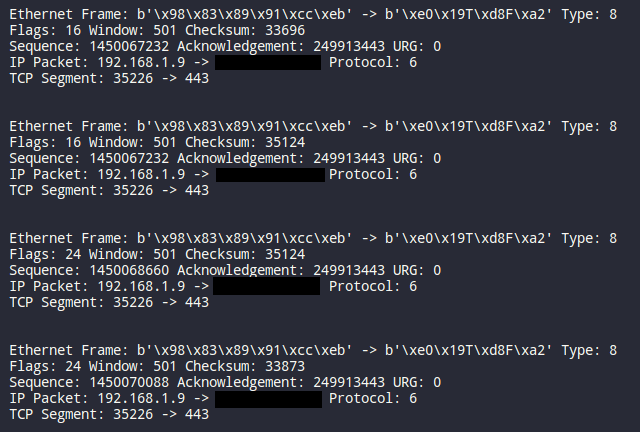

# security-toolbox
Repository for the security toolbox, a collection of tools, exploits, recreations of famous tools and other security related stuff. Basically a collection of things that I find interesting and want to save for later or things I coded just to practice and show off.

## Tools

- firewall_detect: A simple tool that detects if a port is open, closed or filtered by a firewall.

## Recreations

- tcpdump: A recreation of the famous tcpdump tool, a packet analyzer that allows the user to display TCP/IP and other packets being transmitted or received over a network to which the computer is attached.

## Exploits

- Windows Blue Screen of Death: A simple .bat that crashes a Windows machine by sending a specially crafted packet to the target machine.

- Bluetooth Bluebugging: A simple script that uses the Bluebugging to send AT commands to a target device. Doesn't have the commands to actually do anything, just the script to send the commands.